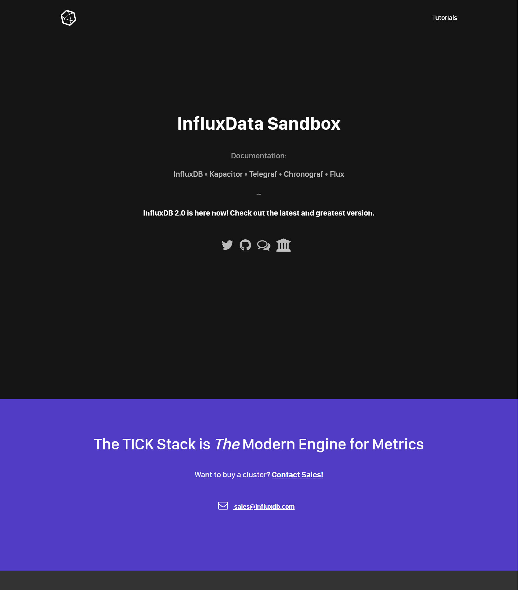
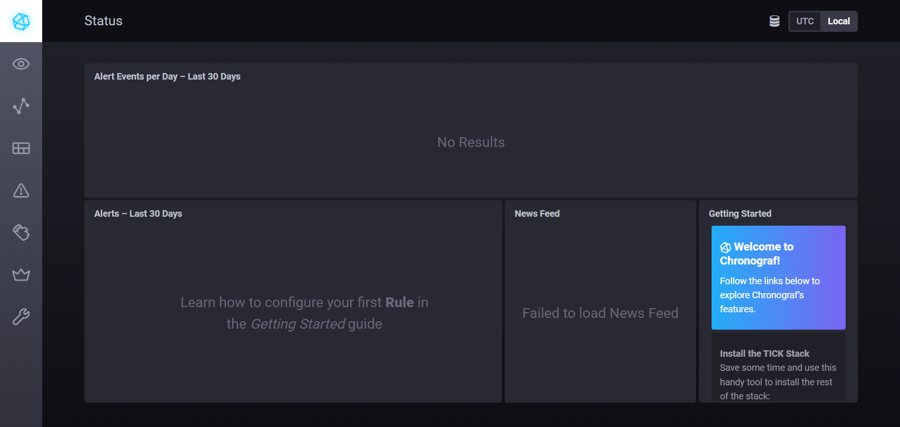
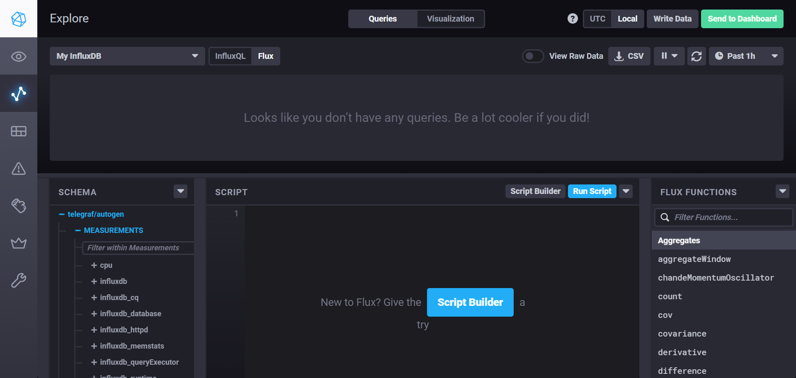
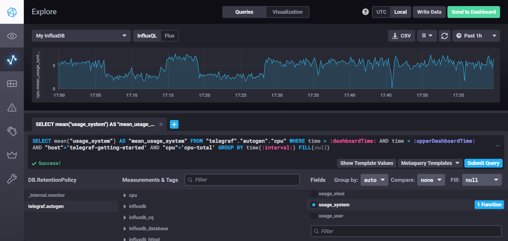
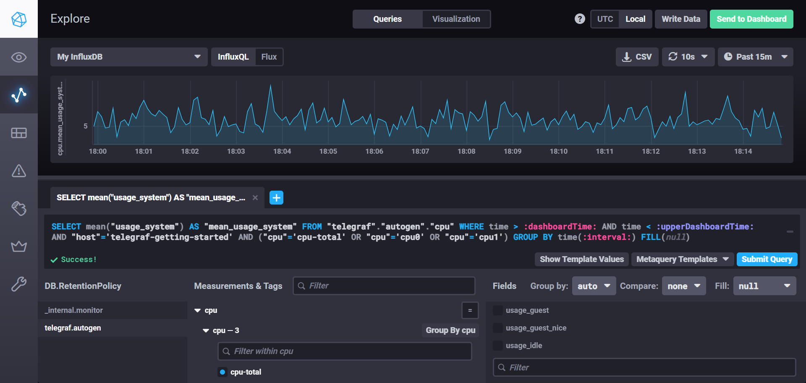

# Домашнее задание к занятию "Системы мониторинга"
## Обязательная часть
### Задание 1. 
Минимальный набор строится на 4 золотых сигналах: Latency (HTTP, генерация отчета), Traffic (RPS, запись на диск), Errors (коды ответов, ошибки сохранения), Saturation (CPU, память, диск, inode). На Python напишем подсчет количества созданных отчетов и время их создания, по данному показателю, можно будет вывести аналитику о загруженности/перегруженности или недоступности системы.</br>
Показатель задержка и затем доступность - самые основные, чтобы проанализировать задержки на vSAN или Fiber ChannelSAN или NAS. Указать на проблеммы провайдеру ЦОД, спросить не проводятсяли какие-либо работы у провайдера.</br>
Про CPU, посмотреть надо утилизацию сетевого трафика и дисков. Не редко сеть при неправильной настройкедрайверов или выборе сетевых карт, использует CPU, тем самым нагружая систему.</br>
Так же, мы должны учитывать необходимость задавать интервал для полной антивирусной проверки или выполнения бекап, и снапшоты если они делаются на уровне операционной системы, а не на уровне СХД. Чтобы избежать кратковременных, но последовательных отказов сервиса, в технологическое окно.</br>
### Задание 2.
Рекомендую менеджеру, рассмотреть показатели SLI и SLO. SLI покажет как работает приложение со стороны пользователя или сотрудников, SLO дает нам понимание для проведения разработки, допилить фичи, провести тесты, а далее выкатить их в релиз, обязательно мониторя сервис после выкатки на колличество "падений" со стороны пользователя.</br>
Используем такие показатели, как: - процент успешных HTTP-запросов (без 5xx ошибок). - процент успешно созданных и сохраненных отчетов.</br>
Далее для каждого показателя мы вместе с менеджером установим цели (SLO). К примеру: 95% отчетов генерирующихся быстрее 3 секунд и доступностью 99.9%. На их основе сделаем дашборд со "светофором": зеленый — цели выполняются, красный — есть проблема, синий - допустимое состояние загрузки (учитываются сбор метрик в технологическое окно).</br>
### Задание 3.
Ситуация классическая, денег на стек сбора логов типа Elastic Stack, Graylog, Loki - не дали, будем выкручиваться своими силами.</br>
Рассмотрим другие продукты:</br>
1. Grafana OSS (Open Source) — базовая, бесплатная редакция с открытым исходным кодом.
2. Prometheus - система для мониторинга и алертинга с открытым исходным кодом.
3. InfluxDB (не Enterprise) — база данных временных рядов с открытым исходным кодом.
4. Zabbix - система мониторинга корпоративного уровня с открытым исходным кодом.
5. Sentry - предполагает бесплатную пробную версию и платные планы. Подход Sentry Fair Source был разработан как компромисс между открытым исходным кодом и коммерческой лицензией. Он позволяет использовать программное обеспечение бесплатно, если мы не применяем его в конкурирующем продукте, а пользуетесь Sentry только для внутренних целей разработки, некоммерческих образовательных проектов и исследований. В остальных случаях потребуется приобрести коммерческую лицензию. Одной из ключевых особенностей fair source является условие отложенной публикации исходного кода, называемое Delayed Open Source Publication (DOSP). То есть по прошествии определённого времени код становится полностью открытым. Например, для функциональной лицензии Sentry (Functional Source License, FSL) этот период составляет 2 года, а для бизнес-лицензии Business Source License (BUSL) — 4 года.</br>

Архитектура данного решения представлена на рисунке 1:

</br>
Рисунок 1. Архитектура предложенного решения.</br>
Алгоритм работы:
1. Как всё связано в работе Приложение падает → Sentry ловит ошибку → разработчик получает уведомление в Slack → открывает Sentry, видит стек-трейс и контекст.</br>
2. Нужно понять, почему упало → разработчик идёт в Grafana → смотрит логи (Loki) по времени ошибки → смотрит трейсы (Tempo), чтобы увидеть полный путь запроса.
3. Начинает тормозить база данных → Prometheus замечает рост времени ответа → Alertmanager отправляет предупреждение DevOps → DevOps открывает Grafana, смотрит метрики CPU, IOPS, количество соединений → принимает меры (скейлинг, оптимизация запросов).
4. Закончилось место на диске → Zabbix триггер срабатывает → уведомление в Slack → DevOps проверяет, чистит логи или расширяет диск.</br>

Разработчики видят это следующим образом:

</br>
Рисунок 2. Схема с точки зрения разработчика.</br>

### Задание 4.
Ошибка в том, что формула summ_2xx_requests / summ_all_requests учитывает не все успешные ответы, а только 2xx. В HTTP-спецификации успешными считаются не только 2xx, но и 3xx (редиректы). В нашей системе нет 4xx (ошибки клиента) и 5xx (ошибки сервера). Составим формулу: SLI = (summ_2xx_requests + summ_3xx_requests) / (summ_all_requests).</br>
В результате мы получили 100% информации.</br>

### Задание 5.
Push отправляет инфу и может за-ddos'ить систему, в то время как pull наоборот при недоступности сервиса может молчать. Push: Агент отправляет данные Cервис инициирует соединение и отправляет метрики на сервер или агент сервера.</br>
Плюсы push:</br>

- Простота масштабирования и безопасности сети. Агентам не нужно открывать входящие порты на серверах. Сборщик может быть на вненем IP, что важно при работе с географически распределенной инфраструктурой или спрятан за NAT.
- Если на внутренней сети есть разрешающие правила (10500, 10501 для активных агентов), а так же Push-протоколы часто работают поверх TCP/HTTP с возможностью получения подтверждения (200 OK), то если агент не получил подтверждение, он может положить данные в буфер на диске и отправить позже. Это снижает риск потери метрик при перезагрузке агента.
- Низкая задержка оповещений. Агент может отслеживать состояние на месте и моментально отправить критический алерт, не дожидаясь, пока сервер «вспомнит» его опросить. При этом как говорил в начале при сетевой недоступности, может появиться окно недоступности.
- Сервер мониторинга может потребовать выделить себе большие вычислительные мощности, CPU RAM HDD, потому что сам будет перегружен в результате опрашивания серверов, в том числе он будет гененрировать много сетевого трафика. Агент же отправляет данные по расписанию.

Минусы:

- ddos на инфраструктуру, если 10 000 агентов одновременно решат отправить данные, после потери связи или при рестарте, это создаст нагрузку на базу данных и сеть.
- не понятно сколько данных отправляет агент. Сломавшийся агент на сервере может генерировать очень много метрик, создавая нагрузку на инфраструктуру мониторинга.
- чтобы начать мониторить новый сервер, нужно заранее завести его в систему мониторинга "руками", или использовать Discovery.
- push-системе перегруженный агент начинает терять данные или отказывать агентам.

Pull-модель (Сервер мониторинга опрашивает) При этой схеме сервер мониторинга инициирует соединение к экспортерам или API целевых систем.</br>
Плюсы:

- Преимуществом является факт, что если сервис упал или сеть недоступна, сервер получает timeout и возникет аллерт Down или Disconnected или Unavaliable и тому подобное. В итоге, в push-системе, если агент не отвечает вместе с сервером, то пожно явно сказать что проблемма с сетевой связанностью или с серваком.
- Централизованный контроль опроса. Если сервер перегружен, то он может замедлить опрос (скрейпинг), не теряя данные сдвигая временные метки.
- Простота авторизации и безопасности. Достаточно настроить TLS-сертификаты и базовую аутентификацию на стороне экспортеров или агентов того же забикса. Что позволит быстро получить информацию о системе и lasted data.
- Автоматическое обнаружение. Такие системы идеально интегрируются с облачными средами и оркестраторами (K8s). Сервер видит список подов через API K8s и автоматически начинает их опрашивать без необходимости переконфигурировать агентов.

Минусы:

- Сложность работы с NAT и динамическими портами. Если сервер находится в защищенном периметре, а рабочие станции или удаленные дата-центры — за NAT, Pull-сервер физически не может достучаться до них. Это требует развертывания прокси (Pushgateway в Prometheus) или туннелей, что фактически превращает систему в гибрид.
- Нагрузка на экспортеры. Если один сервер мониторинга опрашивает 5000 целей каждые 15 секунд, это создает постоянный поток TCP-соединений. А так же, частый опрос, может приводить к повышенной нагрузке на CPU и сериализации.
- Ограниченная кастомизация интервалов опросов. Как правило интервал опроса одинаков для группы объектов мониторинга. Если нужно для одного критичного сервиса собирать метрики раз в секунду, а для остальных раз в минуту, то конфигурация становится громоздкой, и нагрузка на сервер возрастает не линейно.

### Задание 6.

К pull моделям относятся:

- TICK (Telegraf, InfluxDB, Hronograf, Kapacitor. Сам находит сои компоненты, БД можно любую).
- Prometheus (хотя при добавлении Pushgateway это скорее гибридный вариант).
- Nagios.

К push модели относятся:

- Zabbix (агенты поставляют данные на сервер, но сетевое оборудование он может опрашивать сам с помощью SNMP, что делает его в этом случае гибридным).

К гибридным модели относятся:

- VictoriaMetrics (гибридная система, проектировалась как высокопроизводительное хранилище, способное работать в обоих режимах).

### Задание 7.

Склонировал и исправил [репозиторий](https://github.com/avdevninsr/sandbox), после чего запустил TICK стек:

</br>
Рисунок 3. Запущенный TICK стек.</br>

### Задание 8.

Веб интерфейс хронографа представлен на риунках 4 и 5:

</br>
Рисунок 4. Веб интерфейс хронографа на старте.</br>

</br>
Рисунок 5. Measurements.</br>
Запрос на утилизацию процессора представлен на рисункax 6 и 7:

</br>
Рисунок 6. Утилизация процессора.

</br>
Рисунок 7. Поэкспериментировал с настройками.</br>

### Задание 9

Изучил [список плагинов телеграф](%D0%9F%D0%BB%D0%B0%D0%B3%D0%B8%D0%BD%D1%8B%20%D1%82%D0%B5%D0%BB%D0%B5%D0%B3%D1%80%D0%B0%D1%84%D0%B0.txt). Добавил в конфигурацию telegraf следующий плагин - docker.</br>
В файл /home/tankisst/sandbox/telegraf/telegraf.conf прописываем следующие строки:
```
[[inputs.docker]]
  endpoint = "unix:///var/run/docker.sock"
  container_name_include = []
  container_name_exclude = []
  timeout = "5s"
  docker_label_include = []
  docker_label_exclude = []
```
Далее меняем блок telegraf в docker-compose.yml следующим образом:
```
  telegraf:
    build:
      context: ./images/telegraf/1.40
      dockerfile: ./${TYPE}/Dockerfile
      args:
        TELEGRAF_TAG: ${TELEGRAF_TAG}
    image: "telegraf"
    environment:
      HOSTNAME: "telegraf-getting-started"
    links:
      - influxdb
    volumes:
      - ./telegraf/:/etc/telegraf/
      - /var/run/docker.sock:/var/run/docker.sock:ro
    # Добавляем группу docker с правильным GID
    group_add:
      - "999"
    depends_on:
      - influxdb
    ports:
      - "8125:8125/udp"
      - "8092:8092/udp"
      - "8094:8094"
```
Далее пересобираем сам telegraf:
```
docker compose stop telegraf
docker compose rm -f telegraf
docker compose build --no-cache telegraf
docker compose up -d telegraf
```
На рисунке 8 представлены графики некоторых показателей докер контейнеров:

</br>
Рисунок 8. Метрики докера.

## Необязательная часть
### Задание 1
Запускаем [скрипт](cpu_ram_network_load.py):</br>
```
tankist@ubuntu:~$ ./cpu_ram_network_load.py
[2026-09-27 17:24:39] ✓ Метрики сохранены
  Файл: /home/tankist/mon_hw_1_logs/26-09-27-ubuntu-monitoring.log
  Hostname: ubuntu
  CPU active: 333693
  Memory: 16.8% used (825MB / 4913MB)
  Load: 0.12, 0.44, 0.4
  Processes: 142
  Disks: sda
  Network interfaces: vethdc98622, docker0, vethbd0544b, enp0s8, veth63df976, veth947fd46, br-fdf35d2f3d2b, veth624b60e
```
И получаем [результат](26-09-27-ubuntu-monitoring.log).</br>
Далее создаём крон файл:
```
tankist@ubuntu:~$ crontab -l
# Edit this file to introduce tasks to be run by cron.
#
# Each task to run has to be defined through a single line
# indicating with different fields when the task will be run
# and what command to run for the task
#
# To define the time you can provide concrete values for
# minute (m), hour (h), day of month (dom), month (mon),
# and day of week (dow) or use '*' in these fields (for 'any').
#
# Notice that tasks will be started based on the cron's system
# daemon's notion of time and timezones.
#
# Output of the crontab jobs (including errors) is sent through
# email to the user the crontab file belongs to (unless redirected).
#
# For example, you can run a backup of all your user accounts
# at 5 a.m every week with:
# 0 5 * * 1 tar -zcf /var/backups/home.tgz /home/
#
# For more information see the manual pages of crontab(5) and cron(8)
#
# m h  dom mon dow   command
#0 12 * * * /home/tankist/cpu_ram_network_load.py
*/30 * * * * /home/tankist/cpu_ram_network_load.py
40 7 3 * * ./bin/clean_logs.sh
*/10 * * * * /home/tankist/cpu_ram_network_load.py >> /home/tankist/mon_hw_1_logs/cron.logtankist/mon_hw_1_logs/cron.log
```
Строка
```
0 12 * * * /home/tankist/cpu_ram_network_load.py
```
закомментирована для ускорения получения результата, но именно она соответствует задаче.</br>
Записи создаются по установленному графику, что продемонстрировано на рисунке 9:

</br>
Рисунок 9. Частичный вывод логов крона.</br>
Сам [лог](cron.log).

### Задание 2
На рисунке представлен кастомный дашборд с графиками метрик из задания:

</br>
Рисунок 10. Кастомный дашборд.</br>